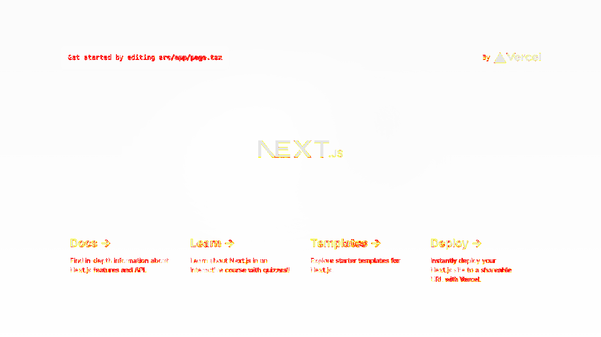

# Playwright Visual Tests Remote Server
## About:
This repository contains an example of using Playwright Remote Servers to standardize the environment when running Visual Tests. It aims to be one of the solutions to avoid environmental flakiness due to rendering differences between them.

You can check an explanation guided step-by-step in this Medium Story that I've written.

## Examples:
The default snapshots were created inside the Playwright Docker image. And you check the differences when running in a macOS and Windows in these images:
  
  

## Requirements:
- [Node JS](https://nodejs.org/en)
- IDE compatible with NodeJS (e.g. [Visual Studio Code](https://code.visualstudio.com/docs/languages/typescript)).
- [Docker](https://www.docker.com/products/docker-desktop/)

## Built with:
- [NextJS](https://nextjs.org/)
- [React](https://react.dev/)
- [Playwright](https://playwright.dev/)